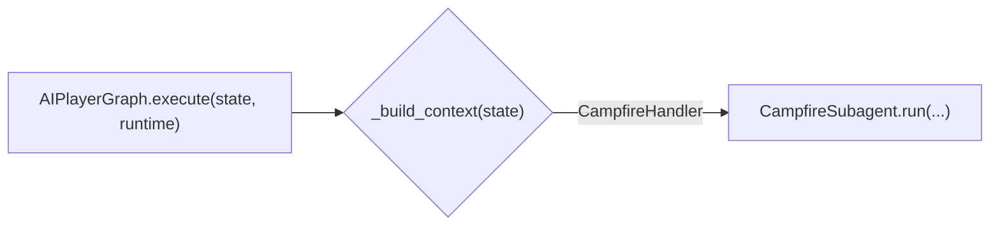
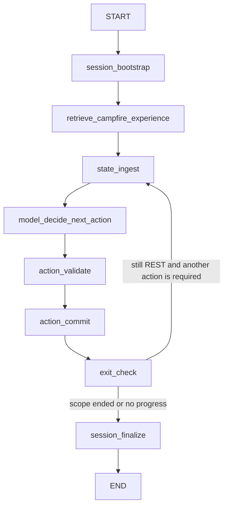

# CampfireHandler Implementation Plan

## Goal

Add `CampfireHandler` as a first-class runtime-aware subagent node in the AI player graph for `REST` screens.

This implementation should follow the same architecture now used for reward screens:

- context builder
- provider/prompt
- subagent node
- graph/runtime wiring
- tests and fixture-backed regressions

This plan intentionally avoids fixed gameplay heuristics such as hardcoded hp thresholds, relic preference orders, or campfire action priority lists.

## Scope

Handle the `REST` screen where the bot chooses among campfire actions such as:

- `rest`
- `smith`
- `dig`
- `toke`
- `lift`
- `recall`

Non-goals for this change:

- the downstream upgrade/removal/transform selection after the campfire choice
- generic `GRID` follow-up handling
- deterministic fallback policy migration

## Target Architecture

Add `CampfireSubagent` as a runtime-aware node parallel to:

- `BattleSubagent`
- `CombatRewardSubagent`
- `BossRewardSubagent`
- `AstrolabeTransformSubagent`

Expected top-level route:

Expected internal graph:

In practice, campfire will usually be a single-step subagent, but keeping the same runtime-aware loop shape preserves architectural consistency and supports future follow-up behavior if the screen ever remains active.

## Context Builder

Add `rs/llm/integration/campfire_context.py` with `build_campfire_agent_context(state, "CampfireHandler")`.

Context should include:

- `available_commands`
- `choice_list`
- `screen_state.rest_options`
- `screen_state.has_rested`
- floor, act, room type, current hp, max hp, gold, class, ascension
- current relic names and counters
- deck size and deck profile
- compact deck card entries
- run memory summary
- whether this is a pre-boss rest site
- whether `rest`, `smith`, `dig`, `toke`, `lift`, `recall` are available

Helpful derived flags are acceptable if they are descriptive rather than prescriptive, for example:

- `is_pre_boss_rest_site`
- `has_shovel`
- `has_peace_pipe`
- `has_girya`
- `has_pantograph`
- `has_coffee_dripper`

These should be surfaced as raw context facts, not converted into fixed action rules.

## Provider

Add `CampfireLlmProvider` under `rs/llm/providers/` and a prompt file under `rs/llm/providers/prompts/`.

Provider output should be standardized to:

- `choose <index>`
- optionally `choose <token>` when unique

Prompt requirements:

- decide only from the supplied payload
- do not use hardcoded hp thresholds or action priority tables
- reason from the current run state, relics, and deck profile
- treat `choice_list` as the executable source of truth
- keep explanations short and factual

## Subagent

Add `CampfireSubagent` in `rs/llm/campfire_subagent.py` or fold it into a broader non-battle subagent module if you want a shared base for future `ChestHandler`/`CampfireHandler`.

Recommended shape:

- `CampfireSubagentConfig`
- `CampfireSessionResult`
- `CampfireSubagentState`
- `CampfireSubagent`

Core behavior:

- build LangMem-enriched campfire context
- ask `CampfireLlmProvider` for one action
- validate with the existing command validator
- map to `[cmd]`
- execute through runtime
- stop when the screen leaves `REST`

## AIPlayerGraph Wiring

Update `rs/llm/ai_player_graph.py` so:

- `_build_context()` routes `REST` to `build_campfire_agent_context(..., "CampfireHandler")`
- `decide()` returns `None` for `CampfireHandler` because it is runtime-aware
- `execute()` routes `CampfireHandler` to `CampfireSubagent.run(...)`
- `_is_single_choice_non_battle_bypass()` does not bypass `REST` states

If you also want advisor-agent parity, mirror `CampfireHandler` registration in `rs/llm/runtime.py`, even if the execution path remains the runtime-aware subagent.

## Command Mapping

Campfire command mapping should remain simple:

- validated `choose <...>` -> `[cmd]`

No extra `wait 30` should be injected unless the runtime or protocol later proves it is necessary.

## Test Plan

### Graph routing

Add graph-routing tests in `tests/llm/test_ai_player_graph.py` to verify:

- `REST` is recognized by `_build_context()`
- `decide()` returns `None`
- `execute()` routes into `CampfireSubagent`

### Context builder

Add `tests/llm/test_campfire_context.py` covering:

- basic `rest/smith/recall` context
- shovel / peace pipe / girya availability flags
- pre-boss detection
- coffee dripper and pantograph surfaced as facts

### Provider prompt tests

Add `tests/llm/test_campfire_llm_provider.py` to assert the prompt includes:

- `rest_options`
- relic facts
- hp and floor information
- deck profile
- anti-heuristic instruction text

### Subagent tests

Add `tests/llm/test_campfire_subagent.py` for:

- one-step `choose rest`
- one-step `choose smith`
- one-step `choose dig`
- one-step `choose toke`
- one-step `choose lift`
- one-step `choose recall`
- single-option `recall` state still routed through the subagent

### Fixture-backed regression coverage

Use the existing `tests/res/campfire/` fixtures at minimum:

- `campfire_rest.json`
- `campfire_smith.json`
- `campfire_dig.json`
- `campfire_toke.json`
- `campfire_girya_lift.json`
- `campfire_default_because_options_blocked.json`
- `campfire_cannot_rest_because_coffee.json`
- `campfire_rest_pantograph_boss.json`
- `campfire_rest_without_pantograph_boss.json`

## Suggested Rollout Order

1. Add campfire context builder.
2. Add provider + prompt.
3. Add campfire subagent with runtime execution loop.
4. Wire `REST` into `AIPlayerGraph`.
5. Add tests.
6. Run `python -m unittest discover -s tests/llm`.

## Acceptance Criteria

- `REST` screens are no longer falling through to generic default selection.
- `CampfireHandler` is runtime-aware and represented as a graph/orchestrator node.
- No fixed campfire action ranking tables are introduced.
- Existing LLM test suite still passes.
- Campfire fixtures have explicit coverage in the new tests.
