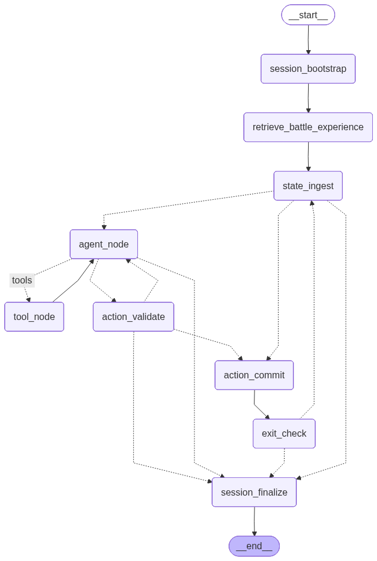
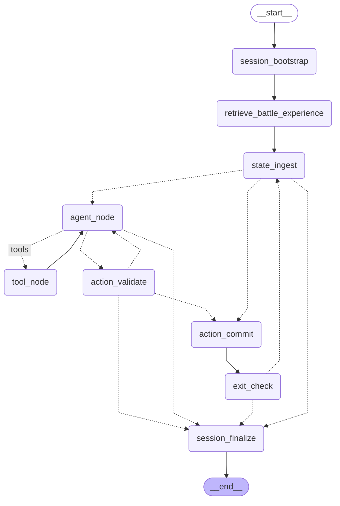

# Battle Subagent Graph

This document describes `BattleSubagent` as a standalone runtime subagent.

Relevant code:
- `rs/llm/battle_subagent.py`
- `rs/llm/battle_tools.py`
- `rs/llm/integration/battle_context.py`
- `rs/llm/providers/battle_llm_provider.py`

## Role In The Runtime

`BattleSubagent` is the runtime subagent used when `AIPlayerGraph._build_context(state)` resolves the current game state to `BattleHandler`.

At the top level:
- `Game.run()` calls `AIPlayerGraph.execute(state, runtime)`
- `AIPlayerGraph.execute(...)` routes `BattleHandler` into the runtime path
- `UnifiedActionExecutor` dispatches that handler to `BattleSubagent`
- `BattleSubagent` loops until battle scope ends or the session must stop

## Native Graph

The graph below is the direct output of:

```python
BattleSubagent(...).get_compiled_graph().get_graph().draw_mermaid()
```

Generated with the repo venv (`venv/bin/python`) and saved in:
- [docs/battle_subagent_native.mmd](/home/ruotoy/snap/steam/common/.local/share/Steam/steamapps/common/SlayTheSpire/bottled_ai/docs/battle_subagent_native.mmd)
- [docs/battle_subagent_native.png](/home/ruotoy/snap/steam/common/.local/share/Steam/steamapps/common/SlayTheSpire/bottled_ai/docs/battle_subagent_native.png)





## Session Lifecycle

The battle subagent has a clear runtime loop:

1. `session_bootstrap`
   Creates the subagent session ID and initializes battle working memory.
2. `retrieve_battle_experience`
   Pulls long-term memories from `LangMemService` into the session.
3. `state_ingest`
   Rebuilds battle context from the latest runtime state.
4. `agent_node`
   Calls the tool-enabled battle model.
5. `tool_node`
   Executes requested tools, then returns control to the model.
6. `action_validate`
   Extracts submitted commands and validates them.
7. `action_commit`
   Executes the accepted command batch through the runtime adapter.
8. `exit_check`
   Re-checks whether the battle is still in scope.
9. `session_finalize`
   Builds the final session summary and emits the result.

## What Makes Battle Different

`BattleSubagent` is the richest subagent in the current runtime because it has a real model/tool loop.

Its graph is more capable than campfire or reward/grid subagents because it can:
- call legal-action enumeration tools
- call calculator analysis tools
- call command-validation tools
- retrieve battle experience as a tool
- submit a command batch back into the runtime

That is why battle is the best reference implementation for “how runtime subagents are designed here.”

## Routing Behavior

The conditional edges in the native graph map to three key routing decisions in code:

- `state_ingest`
  Chooses between normal agent execution, guardrail direct commit, or finalization
  See [battle_subagent.py](/home/ruotoy/snap/steam/common/.local/share/Steam/steamapps/common/SlayTheSpire/bottled_ai/rs/llm/battle_subagent.py#L565)
- `agent_node`
  Chooses whether to continue into tools, validate a submitted command batch, or stop
  See [battle_subagent.py](/home/ruotoy/snap/steam/common/.local/share/Steam/steamapps/common/SlayTheSpire/bottled_ai/rs/llm/battle_subagent.py#L574)
- `action_validate`
  Chooses whether to retry the model, commit commands, or finalize
  See [battle_subagent.py](/home/ruotoy/snap/steam/common/.local/share/Steam/steamapps/common/SlayTheSpire/bottled_ai/rs/llm/battle_subagent.py#L604)

## Memory Model

`BattleSubagent` uses both long-term and short-term memory, but not in the same way as the one-shot `AIPlayerGraph`.

### Long-term memory

Long-term memory comes from `LangMemService`:
- retrieval during `retrieve_battle_experience`
  See [battle_subagent.py](/home/ruotoy/snap/steam/common/.local/share/Steam/steamapps/common/SlayTheSpire/bottled_ai/rs/llm/battle_subagent.py#L244)
- accepted-decision recording after successful commits
  See [battle_subagent.py](/home/ruotoy/snap/steam/common/.local/share/Steam/steamapps/common/SlayTheSpire/bottled_ai/rs/llm/battle_subagent.py#L674)
- final reflected battle summary at session end
  See [battle_subagent.py](/home/ruotoy/snap/steam/common/.local/share/Steam/steamapps/common/SlayTheSpire/bottled_ai/rs/llm/battle_subagent.py#L528)

### Short-term memory

Short-term memory is session-local working memory, not the `InMemorySaver` checkpoint used by the one-shot `AIPlayerGraph`.

Battle working memory tracks:
- recent step summaries
- executed command batches
- retrieved episodic and semantic memories
- LangMem status
- no-progress counters
- previous state signatures
- last executed command batch

See [battle_subagent.py](/home/ruotoy/snap/steam/common/.local/share/Steam/steamapps/common/SlayTheSpire/bottled_ai/rs/llm/battle_subagent.py#L69)

## Guardrails

Battle has the strongest guardrails among the current runtime subagents.

- No-progress guardrail in `state_ingest`
  It can bypass the model and commit a fallback batch directly when repeated state signatures indicate no progress.
  See [battle_subagent.py](/home/ruotoy/snap/steam/common/.local/share/Steam/steamapps/common/SlayTheSpire/bottled_ai/rs/llm/battle_subagent.py#L284)
- Validation retry loop in `action_validate`
  It feeds corrective instructions back into the model when submitted commands are invalid.
  See [battle_subagent.py](/home/ruotoy/snap/steam/common/.local/share/Steam/steamapps/common/SlayTheSpire/bottled_ai/rs/llm/battle_subagent.py#L420)
- Guardrail fallback after validation exhaustion
  It can replace invalid submissions with a deterministic fallback command batch.
  See [battle_subagent.py](/home/ruotoy/snap/steam/common/.local/share/Steam/steamapps/common/SlayTheSpire/bottled_ai/rs/llm/battle_subagent.py#L439)

## Relationship To Other Subagents

`BattleSubagent` should be read as the canonical runtime-subagent pattern.

Other runtime subagents are simplified versions of the same idea:
- session bootstrap
- current-state ingest
- provider or model reasoning
- validation
- runtime commit
- scope re-check
- finalization

The main difference is that campfire and reward/grid subagents remove most of the tool-loop complexity and keep a simpler propose/validate/commit cycle.
