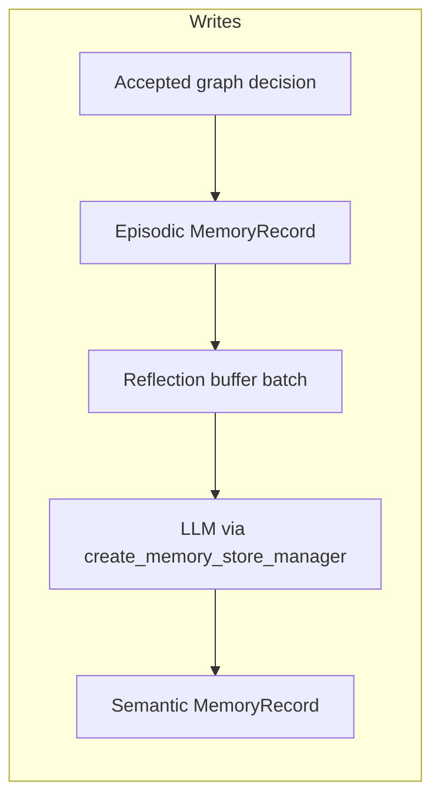

# LangMem: enablement, storage, and reflection

This document describes how LangMem is wired in Bottled AI: configuration, when memories are written, how they are “distilled” into semantic form, where they live on disk, and how they surface in later decisions.

## Is LangMem enabled?

In repo defaults, yes: `configs/llm_config.yaml` sets `langmem.enabled: true` under the top-level LLM `enabled` block. That value is loaded into `LlmConfig.langmem_enabled` in `rs/llm/config.py`.

You can override it with the environment variable `LANGMEM_ENABLED` (`true` / `false` / `1` / `0`, etc., per the same parsing as other LLM flags).

**Important:** “Enabled in YAML” is not the same as “actually working.” `LangMemService` in `rs/llm/langmem_service.py` only reaches status `ready` after a successful embedding health check (`embed_query("langmem health check")`). If that fails—for example missing `sentence-transformers` / model download, or misconfigured remote embeddings—the service stays in `embeddings_unavailable` and **all** record, reflect, and search calls become no-ops. Check `langmem_status` in logs or graph trace; if it is not `ready`, fix embeddings first.

## Where knowledge is stored

- **SQLite:** default path `dataset/langmem/memory.sqlite3` (`langmem.sqlite_path` in YAML, or env `LANGMEM_SQLITE_PATH`). Schema and access are in `LangMemRepository` in `rs/llm/langmem_service.py` (table `langmem_records`).
- **In-process index:** LangGraph’s `InMemoryStore` with embeddings over the `content` field. On startup the service **hydrates** the in-memory store from SQLite.

## Episodic vs semantic (“distillation”)

### Episodic memories (per run)

- Written in `LangMemService.record_accepted_decision()` when the AI player graph commits a valid decision. The `commit_short_term_memory` node in `rs/llm/ai_player_graph.py` builds an `AgentDecision` and calls `record_accepted_decision`.
- **Skipped** when: the service is not ready; `proposed_command` is `None`; or `fallback_recommended` is true (see guards in `record_accepted_decision`).
- **Namespace:** `("run", agent_identity, character_class, seed)` — see `_run_namespace()` in `langmem_service.py`. Episodic entries are tied to **that run’s** class and seed, not to all runs globally.

### Semantic memories (reflection / distillation)

- **Mechanism:** batches of episodic text (and optionally a run-end summary) are passed to LangMem’s `create_memory_store_manager` with a `ChatOpenAI` client configured from `rs/utils/config.py` (`fast_llm_model`, `LLM_BASE_URL`, keys—the same stack as the rest of the LLM runtime). See `_reflect_batch` and `_build_reflection_manager` in `langmem_service.py`.
- **When reflection runs:**
  - After every `langmem_reflection_batch_size` accepted decisions for the same `run_id` (default **5** in `configs/llm_config.yaml`), **or**
  - At run end: `Game.__finalize_langmem_run()` in `rs/machine/game.py` calls `finalize_run()`, which flushes the per-run buffer, appends a textual run summary (floor, score, victory, bosses, elites), and submits `_reflect_batch` on a single-worker thread pool.
- **Namespace:** `("semantic", agent_identity, character_class, handler_name)` — semantic memories are **per handler** (e.g. map vs battle), not per seed.
- **Cap:** `_prune_semantic_namespace` keeps only the newest `max_semantic_memories_per_namespace` entries (default **50**) per semantic namespace.

## How memories influence later decisions

`LangMemService.build_context_memory(context)` builds a query string from the current `AgentContext` (handler, screen, act/floor, choices, run summary, etc.) and runs two vector searches: one in the episodic run namespace and one in the semantic namespace for that handler. Each search is limited by `top_k` (default **3**).

The formatted strings are injected into graph/subagent state and into provider prompts (for example `rs/llm/ai_player_graph.py` and providers such as `rs/llm/providers/map_llm_provider.py`).

## Configuration reference

All under `langmem` in `configs/llm_config.yaml` (with env overrides as defined in `rs/llm/config.py`):

| YAML key | Purpose |
|----------|---------|
| `enabled` | Master toggle (`LANGMEM_ENABLED`) |
| `sqlite_path` | SQLite file (`LANGMEM_SQLITE_PATH`) |
| `embeddings_base_url` / `embeddings_api_key` / `embeddings_model` | Remote OpenAI-compatible embeddings; if `embeddings_base_url` is empty, local `sentence-transformers` is used |
| `top_k` | Retrieved items per search (`LANGMEM_TOP_K`) |
| `reflection_batch_size` | Episodic lines before one reflection LLM call (`LANGMEM_REFLECTION_BATCH_SIZE`) |
| `max_semantic_memories_per_namespace` | Pruning cap for semantic memories (`LANGMEM_MAX_SEMANTIC_MEMORIES_PER_NAMESPACE`) |

## How to verify it is working

1. **Status:** In logs or `logs/ai_player_graph.jsonl` (if graph trace is on), look for `langmem_status`. It should be `ready` for any persistence or retrieval to occur.
2. **Disk:** After a run with a ready service and recorded decisions, `dataset/langmem/memory.sqlite3` should exist and typically grow over time.
3. **Dependencies:** Local embeddings require a working `sentence-transformers` setup (see `requirements.txt`). Remote embeddings require a reachable endpoint and a model id that passes the startup `/models` check when a base URL is set.

## Caveat: run finalization without `game_state`

If the last Communication Mod JSON payload does not include `game_state`, `Game.__finalize_langmem_run()` may skip calling `finalize_run()` (it logs and returns early). In that case you lose the **final** reflection flush and run summary for that exit. Episodic rows already stored and reflection batches that already completed (e.g. every N decisions) are unaffected.

## Related code

- `rs/llm/langmem_service.py` — service, repository, reflection, search
- `rs/llm/config.py` — YAML + env loading for LangMem
- `configs/llm_config.yaml` — defaults
- `rs/machine/game.py` — `__finalize_langmem_run()`
- `rs/llm/ai_player_graph.py` — context enrichment, `record_accepted_decision` from the graph
