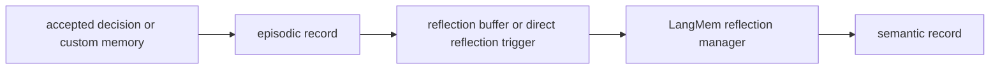

# LangMem: enablement, storage, retrieval, and reflection

This document describes how LangMem is wired in Bottled AI today: configuration, where records live, what gets written, how semantic reflection works, and how memories show up in later decisions.

Relevant code:
- `rs/llm/langmem_service.py`
- `rs/llm/config.py`
- `configs/llm_config.yaml`
- `rs/llm/ai_player_graph.py`
- `rs/llm/battle_subagent.py`
- `rs/llm/campfire_subagent.py`
- `rs/llm/reward_subagent.py`
- `rs/machine/game.py`

## Is LangMem enabled?

In repo defaults, yes:
- `configs/llm_config.yaml` sets `langmem.enabled: true`
- that value loads into `LlmConfig.langmem_enabled` in `rs/llm/config.py`

You can override it with:
- `LANGMEM_ENABLED`

Important distinction:
- “enabled in config” is not the same as “ready at runtime”
- `LangMemService` only becomes `ready` after embeddings initialize successfully and the service hydrates its in-memory store
- if initialization fails, status becomes `embeddings_unavailable:<reason>`

When LangMem is not ready:
- retrieval does not search the store and instead returns:
  - `retrieved_episodic_memories: "none"`
  - `retrieved_semantic_memories: "none"`
  - `langmem_status: <non-ready status>`
- write paths like `record_accepted_decision`, `record_custom_memory`, and `finalize_run` return early

With current repo defaults, `langmem.fail_fast_init: true`, so startup failure is expected to raise rather than silently continue.

## Where memories are stored

LangMem has two storage layers:

- **SQLite**
  Default path: `dataset/langmem/memory.sqlite3`
  Implemented by `LangMemRepository`
  Table: `langmem_records`
- **In-process vector store**
  `langgraph.store.memory.InMemoryStore`
  Indexed over the `content` field
  Hydrated from SQLite during service initialization

If embeddings fail to initialize, the service never becomes ready and the SQLite repository may not be created at all.

## Memory types

There are two persisted memory types:

- `episodic`
  Concrete accepted decisions or custom memory lines tied to a specific run
- `semantic`
  Distilled memories produced by reflection over episodic text

## Namespaces

### Episodic namespace

Run-local episodic memories are stored under:

```text
("run", agent_identity, character_class, seed)
```

This comes from `_run_namespace()` in `rs/llm/langmem_service.py`.

That means episodic memories are:
- per agent identity
- per character class
- per run seed

### Semantic namespace

Reflected semantic memories are stored under:

```text
("semantic", agent_identity, character_class, handler_name)
```

This comes from `_semantic_namespace()` in `rs/llm/langmem_service.py`.

That means semantic memories are:
- per agent identity
- per character class
- per handler
- not per seed

## What writes episodic memory

### Accepted decisions

`LangMemService.record_accepted_decision()` writes one episodic record when:
- the service is ready
- `decision.proposed_command` is not `None`
- `decision.fallback_recommended` is false

This path is used by:
- the one-shot `AIPlayerGraph`
- `BattleSubagent`
- `CampfireSubagent`
- reward/grid subagents
- the older `AIPlayerAgent` orchestrator wrapper

The stored episodic text currently looks like:

```text
A{act} F{floor} {handler_name} chose {command} with confidence {confidence} because {explanation}.
```

### Custom memory

`LangMemService.record_custom_memory()` writes episodic memory lines that are not ordinary accepted decisions.

Current important use:
- `BattleSubagent` writes a final battle summary via `record_custom_memory(..., reflect=True)` at session end

Custom memories are also stored in the run namespace as episodic records.

## Reflection: episodic to semantic



Semantic memories are produced by `_reflect_batch()`.

Reflection uses:
- `create_memory_store_manager(...)` from LangMem
- a `ChatOpenAI` model configured from `rs/utils/config.py`
- the semantic namespace for the current handler

### When reflection runs

Reflection can run in three ways:

1. **Accepted decision batch reflection**
   `record_accepted_decision()` appends episodic lines to a run-local buffer
   once the buffer reaches `langmem_reflection_batch_size`, it submits `_reflect_batch(...)`

2. **Custom memory reflection**
   `record_custom_memory(..., reflect=True)` submits `_reflect_batch(...)` immediately for that content

3. **Run finalization reflection**
   `finalize_run()` flushes the remaining per-run reflection buffer, appends a run-end summary string, and reflects that batch asynchronously

### Current defaults

Current repo defaults from `configs/llm_config.yaml`:

| YAML key | Current default |
|----------|-----------------|
| `top_k` | `5` |
| `reflection_batch_size` | `8` |
| `max_semantic_memories_per_namespace` | `200` |
| `fail_fast_init` | `true` |

## Pruning

After semantic writes, `_prune_semantic_namespace()` keeps only the newest:

```text
langmem_max_semantic_memories_per_namespace
```

semantic records for that semantic namespace.

With current repo defaults, that cap is `200`.

## What gets retrieved later

`LangMemService.build_context_memory(context)`:

1. builds a query string from the current `AgentContext`
2. searches the run-local episodic namespace
3. searches the handler-local semantic namespace
4. formats the results into two strings

The current query text includes:
- handler name
- screen type
- act and floor
- choice list
- run summary
- relic names
- deck profile

## Important `top_k` nuance

The vector search uses:

```text
limit = langmem_top_k
```

for both episodic and semantic lookups.

But the formatting layer currently only renders the first **3** results from each search into the returned prompt text.

So today:
- search depth is controlled by `langmem_top_k`
- prompt-visible memory lines are effectively capped at 3 episodic + 3 semantic entries

## How retrieved memories are surfaced

`build_context_memory()` returns:
- `retrieved_episodic_memories`
- `retrieved_semantic_memories`
- `langmem_status`

Those values are then injected into decision context for:
- the one-shot `AIPlayerGraph`
- `BattleSubagent`
- `CampfireSubagent`
- reward/grid subagents
- memory-augmented advisor agents

Providers then read those values from `context.extras` when building prompts.

## Run finalization

At run end, `Game.__finalize_langmem_run()` calls `LangMemService.finalize_run(...)`.

That finalization path:
- flushes any remaining buffered episodic text for the run
- appends a run-end summary string
- submits one reflection batch asynchronously

The current run-finalization summary includes:
- floor
- score
- bosses
- elites
- `run_memory_summary`

It does **not** currently include a `victory` field in the generated summary string.

## Caveat: final payload without `game_state`

If the last Communication Mod payload omits `game_state`, `Game.__finalize_langmem_run()` falls back to the most recent captured game-state snapshot.

If neither exists:
- it logs that LangMem finalization is being skipped
- no final run reflection batch is submitted

Previously written episodic rows and previously completed reflection batches are unaffected.

## Configuration reference

All LangMem settings live under `langmem` in `configs/llm_config.yaml`, with environment overrides in `rs/llm/config.py`.

| YAML key | Purpose | Env override |
|----------|---------|--------------|
| `enabled` | Master toggle | `LANGMEM_ENABLED` |
| `sqlite_path` | SQLite path | `LANGMEM_SQLITE_PATH` |
| `embeddings_base_url` | Remote embeddings endpoint | `LANGMEM_EMBEDDINGS_BASE_URL` |
| `embeddings_api_key` | Remote embeddings key | `LANGMEM_EMBEDDINGS_API_KEY` |
| `embeddings_model` | Embeddings model id | `LANGMEM_EMBEDDINGS_MODEL` |
| `top_k` | Search limit per namespace | `LANGMEM_TOP_K` |
| `reflection_batch_size` | Episodic lines before automatic batch reflection | `LANGMEM_REFLECTION_BATCH_SIZE` |
| `max_semantic_memories_per_namespace` | Semantic pruning cap | `LANGMEM_MAX_SEMANTIC_MEMORIES_PER_NAMESPACE` |
| `fail_fast_init` | Raise if initialization fails | `LANGMEM_FAIL_FAST_INIT` |

## How to verify it is working

1. **Status**
   Look for `langmem_status` in logs, graph trace, or subagent logs.
   Expected healthy state: `ready`

2. **Disk**
   After a ready run that actually records decisions or custom memories, `dataset/langmem/memory.sqlite3` should exist and typically grow

3. **Prompt-visible retrieval**
   In logs you should see `LangMem retrieval | ...`
   The returned episodic and semantic strings should be something other than `none` after enough relevant history accumulates

4. **Embeddings**
   Local mode requires a working `sentence-transformers` setup
   Remote mode requires a reachable OpenAI-compatible endpoint and a model that passes the `/models` availability check

## Current alignment summary

This document now matches the current implementation in these important ways:
- accepted-decision writes are not limited to the one-shot graph
- battle custom summaries are part of LangMem writes
- current repo defaults are `top_k=5`, `reflection_batch_size=8`, `max_semantic_memories_per_namespace=200`, `fail_fast_init=true`
- run finalization summary does not currently include `victory`
- retrieval searches `top_k` items but only formats the first 3 into prompt text
