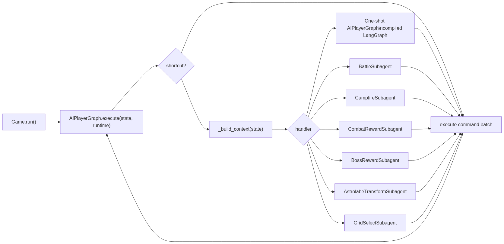
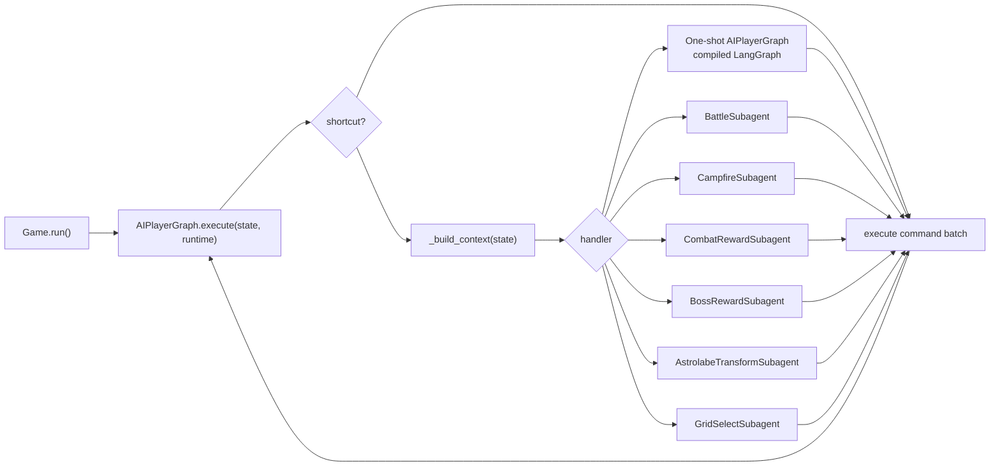
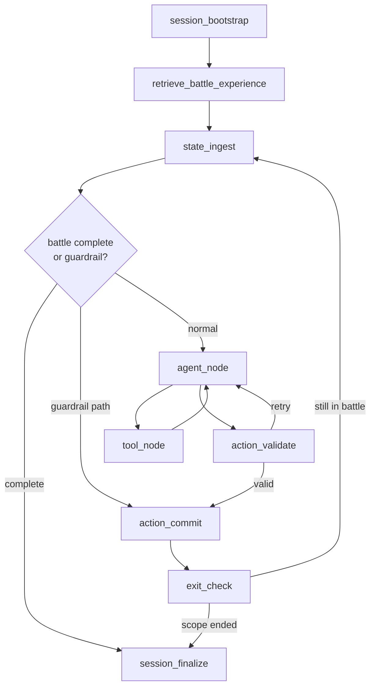
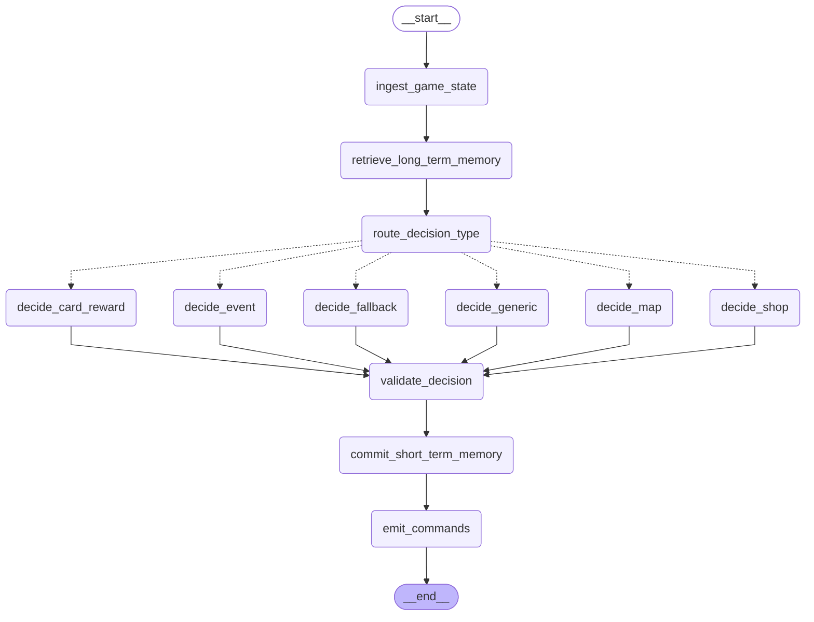
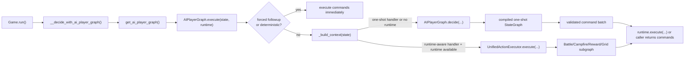
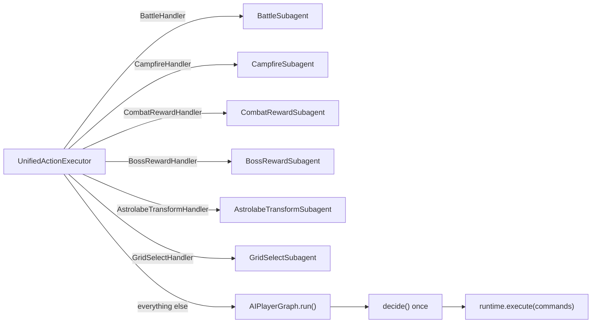
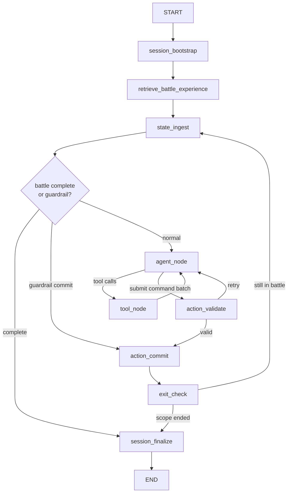
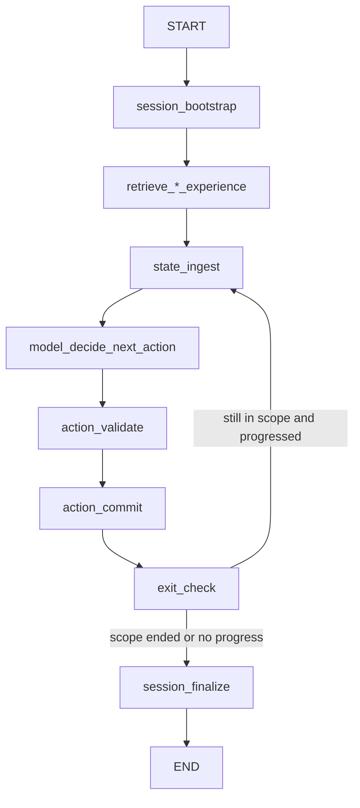

# Orchestrator Graph Design

This document describes the full high-level LLM orchestrator used at runtime.

Relevant code:
- `rs/machine/game.py`
- `rs/llm/runtime.py`
- `rs/llm/ai_player_graph.py`
- `rs/llm/action_executor.py`
- `rs/llm/battle_subagent.py`
- `rs/llm/campfire_subagent.py`
- `rs/llm/reward_subagent.py`
- `rs/llm/langmem_service.py`

## Full Orchestrator

This is the high-level runtime design:

- `Game.run()` hands each state to `AIPlayerGraph.execute(...)`.
- `AIPlayerGraph.execute(...)` aligns the current `GameState` to a handler via `_build_context(state)`.
- That handler is then dispatched either to:
  - the one-shot compiled `AIPlayerGraph`, or
  - a runtime subagent.
- After the chosen path executes a command batch, control loops back into the main orchestrator on the next state update.

Generated source: [docs/orchestrator_high_level.mmd](/home/ruotoy/snap/steam/common/.local/share/Steam/steamapps/common/SlayTheSpire/bottled_ai/docs/orchestrator_high_level.mmd)





## Memory Wiring

### Long-term memory

`LangMemService` is shared across the whole orchestrator:

- one-shot `AIPlayerGraph` retrieves contextual memories and records accepted decisions
- `BattleSubagent` retrieves memories, records accepted battle decisions, and can write a final reflected battle summary
- `CampfireSubagent` retrieves memories and records accepted campfire decisions
- reward/grid subagents retrieve memories and record accepted reward/grid decisions

### Short-term memory

There are two separate short-term memory mechanisms:

- **One-shot graph short-term memory**
  `AIPlayerGraph` compiles its inner graph with `InMemorySaver`. This stores checkpointed fields like `recent_key_decisions` and the derived distilled run summary.
- **Runtime subagent short-term memory**
  Battle, campfire, and reward/grid subagents do not use that checkpointer. Each subagent creates and updates its own session-local working-memory dict for the duration of one subagent run.

This means the subagents do have long-term memory access, but they do not share the one-shot graph's checkpointed short-term state.

## Handler Dispatch

`AIPlayerGraph._build_context()` is the routing table for the runtime orchestrator.

| Screen / condition | Handler name | Execution mode |
| --- | --- | --- |
| battle scope | `BattleHandler` | `BattleSubagent` |
| rest screen with `choose` | `CampfireHandler` | `CampfireSubagent` |
| combat reward with `choose` | `CombatRewardHandler` | `CombatRewardSubagent` |
| boss reward with `choose` | `BossRewardHandler` | `BossRewardSubagent` |
| Astrolabe transform grid | `AstrolabeTransformHandler` | `AstrolabeTransformSubagent` |
| generic grid select | `GridSelectHandler` | `GridSelectSubagent` |
| event with `choose` | `EventHandler` | one-shot `AIPlayerGraph` |
| shop screen | `ShopPurchaseHandler` | one-shot `AIPlayerGraph` |
| card reward | `CardRewardHandler` | one-shot `AIPlayerGraph` |
| map with `choose` | `MapHandler` | one-shot `AIPlayerGraph` |
| chest / hand select / fallback states | `ChestHandler` / `HandSelectHandler` / `GenericHandler` | one-shot `AIPlayerGraph` or safe fallback |

Important details:
- `SHOP_ROOM` is deterministic and becomes `choose 0` to enter the shop.
- `_is_runtime_subagent_scope()` blocks deterministic single-command bypasses for battle/reward/campfire/grid-like states.
- `ChestHandler` and `HandSelectHandler` are still routed through the one-shot path, not dedicated subagents.

## Battle Subagent As The Reference Pattern

Standalone reference: [docs/battle_subagent_graph.md](/home/ruotoy/snap/steam/common/.local/share/Steam/steamapps/common/SlayTheSpire/bottled_ai/docs/battle_subagent_graph.md)

`BattleSubagent` is the best concrete example of what a runtime subagent is supposed to look like in this codebase.

At a high level, it follows this pattern:

1. Start a session and create session-local working memory.
2. Pull long-term experience into that session context.
3. Rebuild context from the latest runtime state.
4. Let the subagent reason, validate, and commit one command batch.
5. Re-check the updated game state.
6. Loop until the scope ends, then finalize the session.

That makes `BattleSubagent` a good mental model for the rest of the runtime subagents, even though the others are simpler.

### Why battle is the clearest example

- It is fully runtime-aware and repeatedly consumes updated game state.
- It makes the session lifecycle explicit: bootstrap, ingest, decide, validate, commit, exit check, finalize.
- It shows the intended separation between:
  - outer orchestrator routing
  - subagent-local session state
  - command execution through the runtime adapter
- It also demonstrates the strongest guardrails: tool-use limits, validation retries, and no-progress fallback behavior.

### Battle subagent structure



### What other subagents inherit from this pattern

- `CampfireSubagent` keeps the same session-loop shape, but replaces the battle tool loop with a lighter propose/validate/commit cycle.
- Reward and grid subagents keep the same scope-based loop and session working-memory model, but use reward-specific command validation and mappings.
- The main simplification in non-battle subagents is that they do less iterative reasoning inside one step; they still fit the same runtime-subagent architecture.

So if someone wants to understand "how a subagent is designed here," `BattleSubagent` should be treated as the canonical reference, and the other runtime subagents should be read as reduced variants of that design.

## Inner One-Shot Graph

The full orchestrator above intentionally keeps the inner `AIPlayerGraph` collapsed into one box.

If you want the native LangGraph dump for that inner graph specifically, it is below. That native dump is the direct output of:

```python
AIPlayerGraph(...).get_compiled_graph().get_graph().draw_mermaid()
```

Generated with the repo venv (`venv/bin/python`) and saved in [docs/ai_player_graph_native.mmd](/home/ruotoy/snap/steam/common/.local/share/Steam/steamapps/common/SlayTheSpire/bottled_ai/docs/ai_player_graph_native.mmd).



Important scope note:
- This is only the compiled one-shot LangGraph inside `AIPlayerGraph`.
- It does **not** include `UnifiedActionExecutor`, `BattleSubagent`, `CampfireSubagent`, or reward/grid subagents, because those are outside this compiled graph and are dispatched by normal Python control flow in `AIPlayerGraph.execute(...)`.

## End-to-End Call Flow



## One-Shot AIPlayerGraph

For event, shop, card reward, map, chest, hand-select, and generic fallback states, `AIPlayerGraph.decide()` executes the compiled `StateGraph` shown above.

### Node responsibilities

- `ingest_game_state`
  Rebuilds short-term run state from the checkpointed `recent_key_decisions` list and creates a distilled run summary.
- `retrieve_long_term_memory`
  Pulls episodic and semantic memories from `LangMemService.build_context_memory(...)`.
- `route_decision_type`
  Maps `handler_name` to one of the route nodes.
- `decide_*`
  Calls the handler-specific provider and retries with validation feedback when the provider returns an invalid command.
- `validate_decision`
  Applies confidence threshold checks, `validate_command(...)`, and `ActionPolicyRegistry.resolve(...)` to convert one command into an executable command batch.
- `commit_short_term_memory`
  Writes the accepted decision to LangMem and updates the checkpointed recent-decision list.
- `emit_commands`
  Returns the final command batch to the caller.

### What this graph stores

- **Short-term run memory:** persisted in the graph checkpointer (`InMemorySaver`) keyed by `thread_id`.
- **Long-term run memory:** retrieved from and written to `LangMemService`.
- **Decision context extras:** the graph injects `run_memory_summary`, `recent_llm_decisions`, `retrieved_episodic_memories`, `retrieved_semantic_memories`, and `langmem_status` into the provider-facing context.

This short-term memory is specific to the one-shot `AIPlayerGraph` path. The runtime subagents do not share this checkpoint.

### Command validation and expansion

The one-shot graph always proposes a single command first, then expands it into protocol commands in `ActionPolicyRegistry`.

Examples:
- event `choose 1` -> `["choose 1", "wait 30"]`
- shop `return` -> `["return", "proceed"]`
- card reward `skip` -> `["skip", "wait 30"]`
- map `choose 2` -> `["choose 2"]`

## Runtime-Aware Subgraph Delegation

When `execute(...)` has a runtime adapter and the state needs iterative interaction, `UnifiedActionExecutor` hands off to a looping subgraph.



### Battle subagent

`BattleSubagent` is the richest runtime LangGraph. It has a model/tool loop:



Battle-specific properties:
- uses LangGraph tool calling with `enumerate_legal_actions`, calculator analysis, command validation, battle-memory retrieval, and `submit_battle_commands`
- detects no-progress loops via state signatures and can bypass the agent with a deterministic fallback batch
- records a summarized battle memory at session end

### Campfire and reward subagents

`CampfireSubagent` and `RewardSubagentBase` use a simpler looping pattern:



These subagents:
- rebuild context from the latest runtime state each loop
- inject LangMem retrieval into working memory once per session
- validate proposed commands before execution
- record accepted decisions after each committed command batch

They do **not** use the one-shot graph's `InMemorySaver` checkpoint. Instead they keep their own session-local working-memory dict for the duration of the subagent run.

## Deterministic Paths That Bypass LLM Work

The orchestrator has several code-level bypasses that are important to keep in mind when reading traces:

- `_deterministic_single_command(...)`
  If there is exactly one meaningful protocol command, the graph is skipped.
- `SHOP_ROOM`
  Always becomes `["choose 0"]`.
- `_forced_followup_commands_after_card_reward_skip(...)`
  Handles the post-skip cleanup between `CARD_REWARD` and `COMBAT_REWARD`.
- `_deterministic_safe_fallback(...)`
  If one-shot `decide()` fails during runtime execution, the graph can still return a safe progression command such as `proceed`, `leave`, `confirm`, `skip`, `cancel`, or `choose 0`.

## Memory, Telemetry, and Trace Surfaces

- **LangMem**
  Used by the one-shot graph and all subagents for contextual retrieval and accepted-decision recording.
- **Short-term checkpointing**
  `AIPlayerGraph` uses `InMemorySaver` so repeated invocations in the same run retain the recent-decision summary.
- **Telemetry**
  Successful one-shot decisions write decision telemetry when enabled.
- **Graph trace**
  `AIPlayerGraph` can emit per-node trace records to `logs/ai_player_graph.jsonl`.

## Design Notes

- The production orchestrator is effectively `Game.run()` + `AIPlayerGraph` + runtime subagents.
- `AIPlayerAgent` in `rs/llm/orchestrator.py` is still useful as a lightweight registry wrapper for advisor-style agents and tests, but it is not the live game-loop orchestrator.
- `UnifiedActionExecutor` is named around “action execution,” but for non-runtime-aware handlers it intentionally falls back to `AIPlayerGraph.run()`, which calls the one-shot graph and then executes the returned commands.
- The graph is handler-centric rather than screen-centric after context build. Once a state has a handler name, routing, validation, command expansion, telemetry, and memory all key off that handler.
- If you are trying to reason about LangMem access versus short-term memory, the split is:
  - LangMem is shared across the one-shot graph and subagents.
  - Checkpointed `recent_key_decisions` memory is only inside the one-shot `AIPlayerGraph`.
  - Subagents use their own session-local working memory instead.
