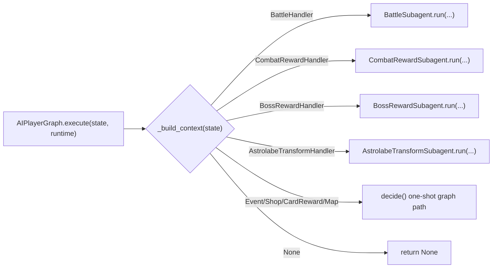
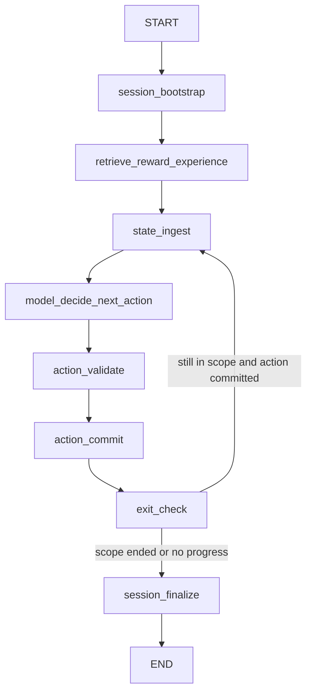
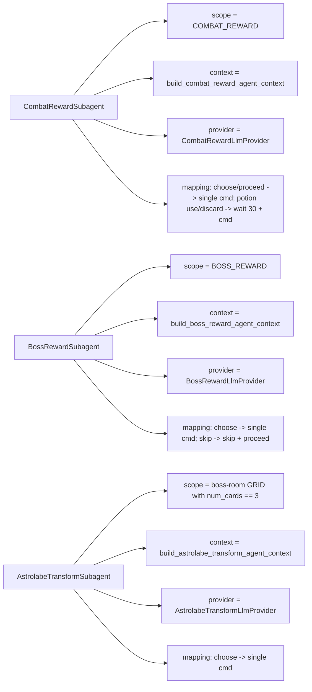
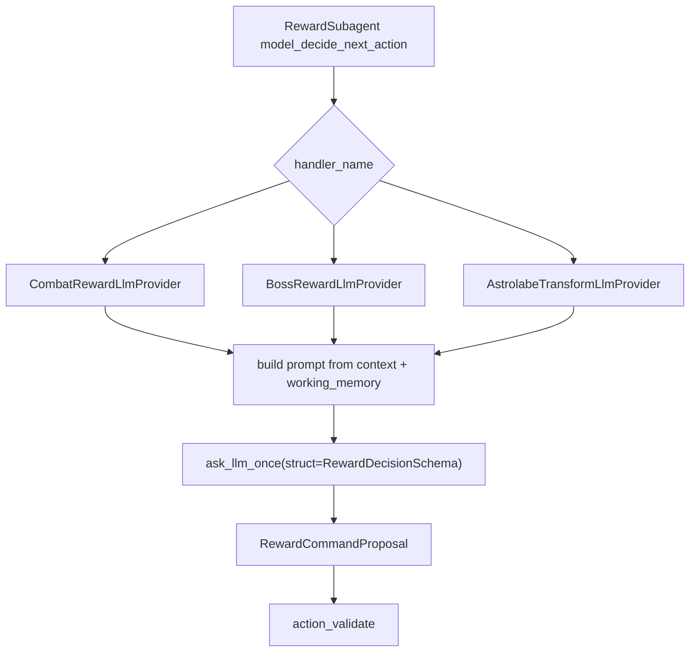

# Reward Subagent Graphs

This document captures the current reward-oriented subagent design that is wired into the AI player graph.

Relevant code:
- `rs/llm/ai_player_graph.py`
- `rs/llm/reward_subagent.py`
- `rs/llm/providers/reward_llm_provider.py`
- `rs/llm/integration/combat_reward_context.py`
- `rs/llm/integration/boss_reward_context.py`
- `rs/llm/integration/astrolabe_transform_context.py`

## Top-level Runtime Routing

`AIPlayerGraph.execute(state, runtime)` now routes runtime-aware domains into dedicated subagents instead of trying to complete them through the one-shot decision graph.

## Shared Reward Subagent Graph

All three reward subagents share the same `RewardSubagentBase` LangGraph state machine. They differ only in scope detection, context builder, provider, and command mapping.

## Node Responsibilities

- `session_bootstrap`
  Creates `session_id`, initializes working memory, and starts the subagent session.
- `retrieve_reward_experience`
  Pulls LangMem episodic/semantic memory into reward working memory.
- `state_ingest`
  Reads the latest runtime state and rebuilds the reward-specific `AgentContext`.
- `model_decide_next_action`
  Calls the reward provider and produces one proposed command.
- `action_validate`
  Validates the proposed command against the current context and rejects ambiguous duplicate-token `choose <token>` commands.
- `action_commit`
  Executes the mapped command batch through the runtime and records the accepted decision.
- `exit_check`
  Re-checks whether the screen is still in this subagent's scope.
- `session_finalize`
  Produces the final session summary and return payload.

## Concrete Reward Subagents

## Provider Layer

The reward subagents are provider-driven rather than priority-table-driven.

## Guardrails

- No fixed gameplay priority tables are used in the reward subagents.
- `choice_list` remains the executable source of truth.
- Duplicate token choices must resolve via `choose <index>` rather than ambiguous token form.
- Runtime-only command expansions stay outside gameplay preference logic:
  - boss reward `skip -> ["skip", "proceed"]`
  - combat reward potion interactions `-> ["wait 30", "potion ..."]`

## Comparison to Battle

`BattleSubagent` has a richer tool loop with calculator and legal-action tools. The reward subagents are intentionally lighter:

- memory enrichment
- current-state context build
- provider proposal
- validation
- runtime commit
- loop until scope exit

That keeps reward execution runtime-aware without reintroducing hardcoded reward heuristics.
